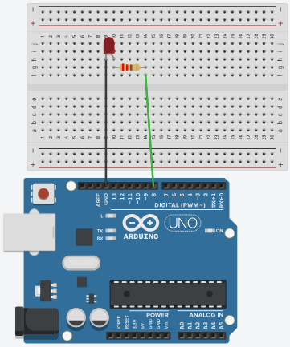

# Week 1 worksheet – Intro to Arduino & Blink

---

## 🎯 Objectives
- **Understanding:** What Arduino is and how it controls inputs and outputs.
- **Safety:** Wire an LED with a current-limiting resistor safely to a digital pin.
- **Uploading:** Upload the Blink sketch and successfully modify timing.
- **Reasoning:** Use Ohm’s Law to justify resistor choices.

---

## 🔌 Wiring guide
- **Connection:** Pin 8 → resistor → LED anode (long leg).
- **Ground:** LED cathode (short leg) → GND.



---

## 💻 Starter code

```cpp
// Week 1: Blink (Pin 8)
void setup() {
  pinMode(8, OUTPUT); // Set pin 8 as output
}

void loop() {
  digitalWrite(8, HIGH); // LED on
  delay(500);            // Wait 0.5 seconds
  digitalWrite(8, LOW);  // LED off
  delay(500);            // Wait 0.5 seconds
}
```

---

## 🧠 Core concepts
- **Digital output:** HIGH ≈ 5 V, LOW ≈ 0 V.
- **Pin mode:** Use `pinMode(pin, OUTPUT)` for digital outputs.
- **Sketch structure:** `setup()` runs once; `loop()` repeats forever.
- **Resistor role:** Limits current to protect the LED and the Arduino pin.

> Tip: A typical red LED has a forward voltage around 2.0 V. Aim for 10–20 mA for safe brightness.

---

## 🧩 Challenge tasks
1. **Timing tweak:** Set both delays to 200 ms and observe the change in blink speed.
2. **Pattern design:** Create a short–short–long blink pattern (200 ms, 200 ms, 600 ms).
3. **Ohm’s Law justification:** Estimate a safe resistor value using
   

\[
   R = \frac{V}{I} \quad \Rightarrow \quad R \approx \frac{(5 - 2)}{0.015} \approx 200\ \Omega
   \]


---

## 🔧 Troubleshooting tips
- **Polarity:** Long leg (anode) to resistor/pin; short leg (cathode) to GND.
- **Resistor required:** Never power an LED directly from a digital pin.
- **Connections:** Reseat jumper wires; ensure the resistor spans separate breadboard rows.
- **Upload checks:** Select the correct board and COM port before uploading.

---

## 🤔 Reflection questions
- **Timing:** What changes when you modify `delay` values?
- **Protection:** Why is the resistor necessary with the LED?
- **Structure:** Why does `setup()` run once and `loop()` repeat forever?

---

## 💡 Real‑world application
- **Spot the blink:** Where do you see blinking indicators (routers, bikes, cars, wearables), and what purpose do they serve?
