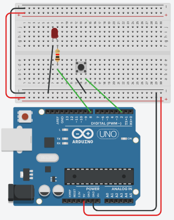

# Week 2 Worksheet: Button Control

---

## 📝 Tasks

1. Build the button + LED circuit on your breadboard.
2. Upload the example code and test — the LED should light when the button is pressed.
3. Modify the code so the LED **toggles** (stays on until the next press).
4. Add a second button to control a second LED.
5. Write comments in your code explaining each line.

---

## 💡 Reflection Questions
- Why do we use `INPUT_PULLUP` instead of wiring an external resistor?
- What happens if you connect the button incorrectly?
- How does the Arduino know the difference between HIGH and LOW?

---

## 🖼️ Diagram
{: style="max-width:600px; display:block; margin:1em auto;" }
