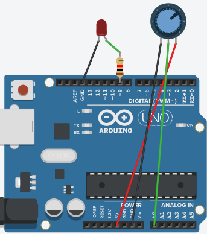

# Week 3 Worksheet – Potentiometer & PWM Control

---

## 🎯 Objectives
- **Understanding:** Learn how analog inputs work with a potentiometer.  
- **Programming:** Use `analogRead()` to capture values and `analogWrite()` to control LED brightness.  
- **Reasoning:** Map input ranges (0–1023) to PWM output ranges (0–255).  
- **Application:** Explore how PWM simulates analog control in real devices.  

---

## 🔌 Wiring guide
- **Potentiometer:** Connect left pin → 5V, right pin → GND, middle pin → A0.  
- **LED:** Anode → Pin 9 (PWM pin), cathode → GND.  



---

## 💻 Starter code

```cpp
// Week 3: Potentiometer + PWM LED
const int potPin = A0;
const int ledPin = 9;

void setup() {
  Serial.begin(9600);       // Start serial monitor
  pinMode(ledPin, OUTPUT);  // LED output
}

void loop() {
  int potValue = analogRead(potPin);          // Read potentiometer (0–1023)
  int brightness = map(potValue, 0, 1023, 0, 255); // Map to PWM range (0–255)

  analogWrite(ledPin, brightness);            // Set LED brightness
  Serial.println(potValue);                   // Print raw value
  delay(50);                                  // Small delay for stability
}
```
---

## 🧠 Core concepts
- **Analog input:** `analogRead()` returns values 0–1023 based on voltage (0–5V).  
- **PWM output:** `analogWrite()` simulates analog voltage by varying duty cycle (0–255).  
- **Mapping:** `map()` converts one range to another, e.g., sensor input → LED brightness.  
- **Serial Monitor:** Useful for debugging and observing sensor values.  

---

## 🥹 Challenge Tasks
1. Modify the code to make the LED blink faster as the potentiometer increases.  
2. Add a second LED that lights only when the potentiometer value > 512.  
3. Experiment with different delays and observe LED smoothness.  
4. Print both raw and mapped values to the Serial Monitor.  

---

## 🔧 Troubleshooting tips
- **Potentiometer wiring:** Ensure middle pin goes to A0, sides to 5V/GND.  
- **PWM pin:** Use pins with `~` symbol (e.g., 9, 10, 11).  
- **Serial Monitor:** Confirm baud rate matches `Serial.begin(9600)`.  
- **LED polarity:** Long leg (anode) to pin, short leg (cathode) to GND.  

---

## 🤔 Reflection questions
- What is the purpose of a potentiometer in an Arduino circuit?  
- How does PWM control the brightness of an LED?  
- Why do we need to map the analog input range to the PWM output range?  
- How does the Serial Monitor help in debugging?  

---

## 💡 Real‑world application
- **Examples:** Volume knobs, light dimmers, joystick controls.  
- **Reflection:** How does PWM make digital devices feel “analog” to us?  

---

## 🖼️ Flash Cards

| Term           | Definition                                                                                   |
| -------------- | --------------------------------------------------------------------------------------------|
| Potentiometer  | A variable resistor used to measure position by changing resistance and output voltage.     |
| PWM            | Pulse Width Modulation, a technique to simulate analog voltage by switching digital signals. |
| analogRead()   | Arduino function to read analog voltage values from sensors (0–1023).                      |
| map()          | Function to convert a number from one range to another, e.g., 0–1023 to 0–255.             |

---

## 🎲 Bonus Challenge
Try adding a second LED that lights up only when the potentiometer value is above a certain threshold.  

---

## 📝 Reflection
Write a short paragraph about what you learned this week regarding analog inputs and PWM control.  

---

## 🧭 Navigation
[Back to Lessons]({{ "/lessons/" | relative_url }}) [Back to Worksheets]({{ "/worksheets/" | relative_url }})
