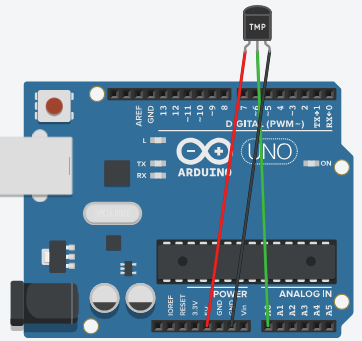

# Week 4 Worksheet – Sensors & Serial Monitor

---

## 🎯 Objectives
- **Understanding:** Learn what sensors are and how they provide input to Arduino.  
- **Programming:** Use `Serial.begin()` and `Serial.print()` to observe sensor data.  
- **Reasoning:** Explain why the Serial Monitor is essential for debugging and analysis.  
- **Application:** Explore how sensor data can be used in real-world projects.  

---

## 🔌 Wiring guide
- **Sensor:** Connect VCC → 5V, GND → GND, signal pin → A0.  
- **Serial Monitor:** Open via Tools → Serial Monitor in Arduino IDE.  



---

## 💻 Starter code

```cpp
// Week 4: Sensor + Serial Monitor
const int sensorPin = A0;

void setup() {
  Serial.begin(9600); // Start serial communication
}

void loop() {
  int sensorValue = analogRead(sensorPin); // Read sensor value (0–1023)
  Serial.println(sensorValue);             // Print value to Serial Monitor
  delay(200);                              // Small delay for readability
}
```
---

## 🧠 Core concepts
- **Sensor:** A device that converts physical phenomena (light, temperature, pressure) into electrical signals.  
- **Serial Monitor:** Displays data from Arduino in real time for debugging and analysis.  
- **Analog input:** `analogRead()` returns values between 0–1023 based on voltage.  
- **Serial communication:** `Serial.begin(9600)` sets baud rate; `Serial.print()`/`println()` send data.  

---

## 🥹 Challenge Tasks
1. Print both raw sensor values and a mapped range (e.g., 0–255).  
2. Add an LED that lights up when sensor value exceeds a threshold.  
3. Experiment with different delays and observe how data readability changes.  
4. Comment each line of your code to explain its purpose.  

---

## 💡 Interactive helper

<iframe src="./week4-helper.html" width="100%" height="640" style="border: none; border-radius: 12px; overflow: hidden;"></iframe>
---

## 🔧 Troubleshooting tips
- **Baud rate:** Ensure Serial Monitor is set to 9600 baud.  
- **Wiring:** Confirm sensor pins are correctly connected to 5V, GND, and A0.  
- **Noise:** Sensor values may fluctuate; use averaging or debounce techniques.  
- **Upload checks:** Confirm correct board and COM port before uploading.  

---

## 🤔 Reflection questions
- Why is the Serial Monitor useful when working with sensors?  
- How could you use sensor data in a real-world project?  
- What limitations might sensors have in accuracy or reliability?  

---

## 💡 Real‑world application
- **Examples:** Temperature sensors in thermostats, light sensors in phones, motion sensors in alarms.  
- **Reflection:** How does sensor data enable automation and smarter devices?  

---

## 🧭 Navigation
[Back to Lessons]({{ "/lessons/" | relative_url }}) [Back to Worksheets]({{ "/worksheets/" | relative_url }})

